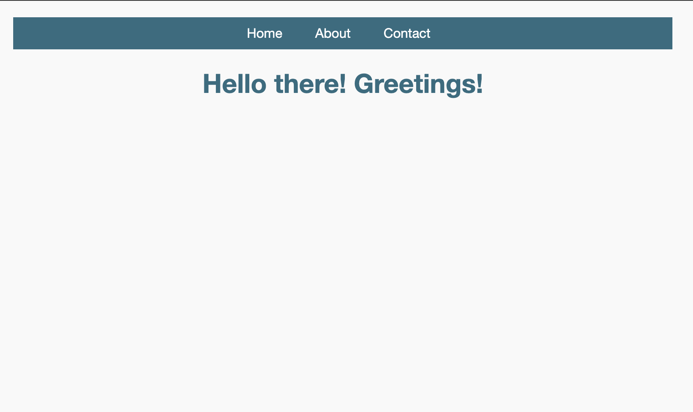

# Odin Project - Basic Info Site

# Usage:
- Clone this repo
- Install dependecies with `npm i`
- cd to the folder with the app.js file
- Run `npm run start`. Navigate to the server `localhost:3000`
- Run the linter with `npm run lint`

# Uses:
- NodeJS
- ExpressJS
- Pug